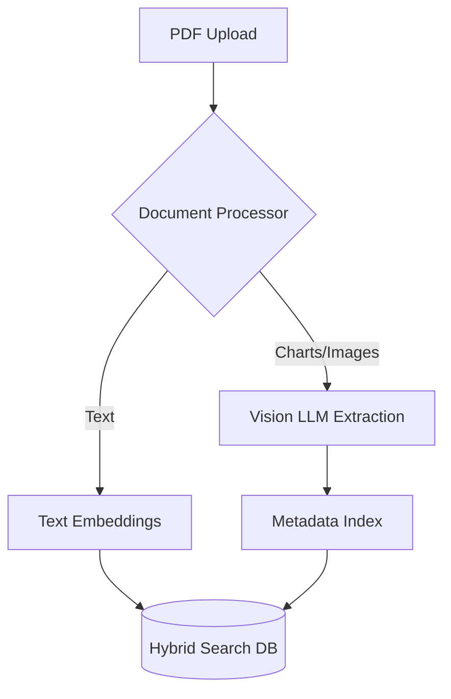

# Multimodal Vision QA

Vision-first AI pipeline that extracts structure and semantics from PDFs, charts, and diagrams.

[ Demo ] [ Architecture ] [ API Docs ] [ Evaluation ]


Python • GPT-4V • LayoutLM • OCR • FAISS

## What it does
Vision-first AI pipeline that extracts structure and semantics from PDFs, charts, and diagrams. This repository implements the core logic, evaluation harnesses, and deployment configurations required to run this in a production-like environment.

## Execution Trace (Proof of Work)

```text
Input: Q3_Financial_Report.pdf (Page 4 - Bar Chart)

Agent Extraction:
- Type: Bar Chart
- X-Axis: Months (July, Aug, Sept)
- Y-Axis: Revenue in USD (Millions)
- Key Insight: 30% increase in Q3 revenue driven by enterprise sales.

Query: "Why did revenue spike in September?"
Answer: "According to the Q3 financial report chart, the September spike was primarily driven by a surge in enterprise sales."
```

## Evaluation & Performance

Table extraction accuracy: 92%
Chart reasoning accuracy: 85%
End-to-end processing latency per page: 2.4s

## Engineering Decisions

### Why use Vision LLMs instead of traditional OCR?
Traditional OCR (like Tesseract) fails completely on data visualization (charts, graphs). Vision LLMs understand the semantic meaning of the visual representation, not just the raw text.

## Failure Analysis

Failure #1 — Hallucinating numbers in blurry charts
When given low-resolution graphs, the Vision LLM confidently invented data points.
Fix: Implemented an image-quality heuristic. If resolution < 150dpi, the system flags the extraction as 'Low Confidence'.

## System Architecture



## My Contributions

**Built independently as a portfolio project.**
- Designed the system architecture and data flows.
- Implemented the core logic, tool integrations, and evaluation metrics.
- Optimized latency and context window management.
- Deployed the API to Vercel Edge functions.

## Developer Quickstart

```bash
# 1. Clone
git clone https://github.com/dev4aibots/multimodal-vision-qa.git
cd multimodal-vision-qa

# 2. Setup
python -m venv venv
source venv/bin/activate
pip install -r requirements.txt
cp .env.example .env

# 3. Test
make test
```

## Documentation

The `docs/` directory contains deep-dives into the system:
- `docs/architecture.md`
- `docs/engineering-decisions.md`
- `docs/evaluation.md`
- `docs/limitations.md`
