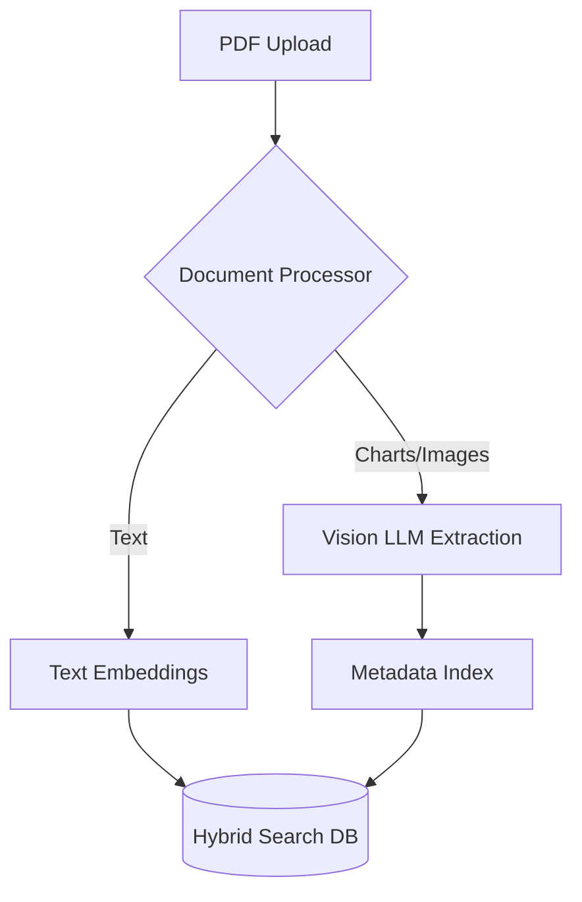

# Multimodal Vision QA


A vision-first AI application that reasons over complex documents (PDFs, charts, diagrams) rather than just extracting plain text.

## Tech Stack
- **Python**
- **Vision Models / Multimodal LLMs**
- **RAG** (Hybrid visual/text retrieval)
- **Document Intelligence**


## Architecture



## Live Endpoint (Interactive Demo)
This project is deployed as a serverless backend on Vercel. You can test the API instantly via your terminal.

```bash
# Example Request


curl -X GET https://multimodal-vision-jk35vvn05-dev4aibots.vercel.app/api/health
```

## Demo
To generate a terminal GIF demonstration using `vhs`, run:
```bash
vhs demo.tape
```
